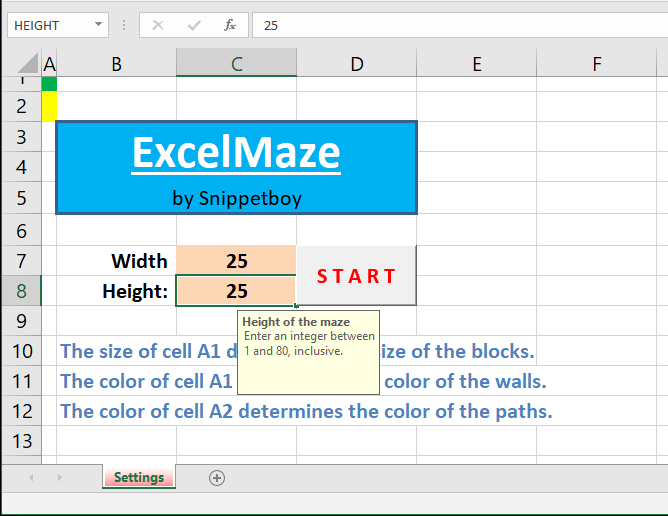
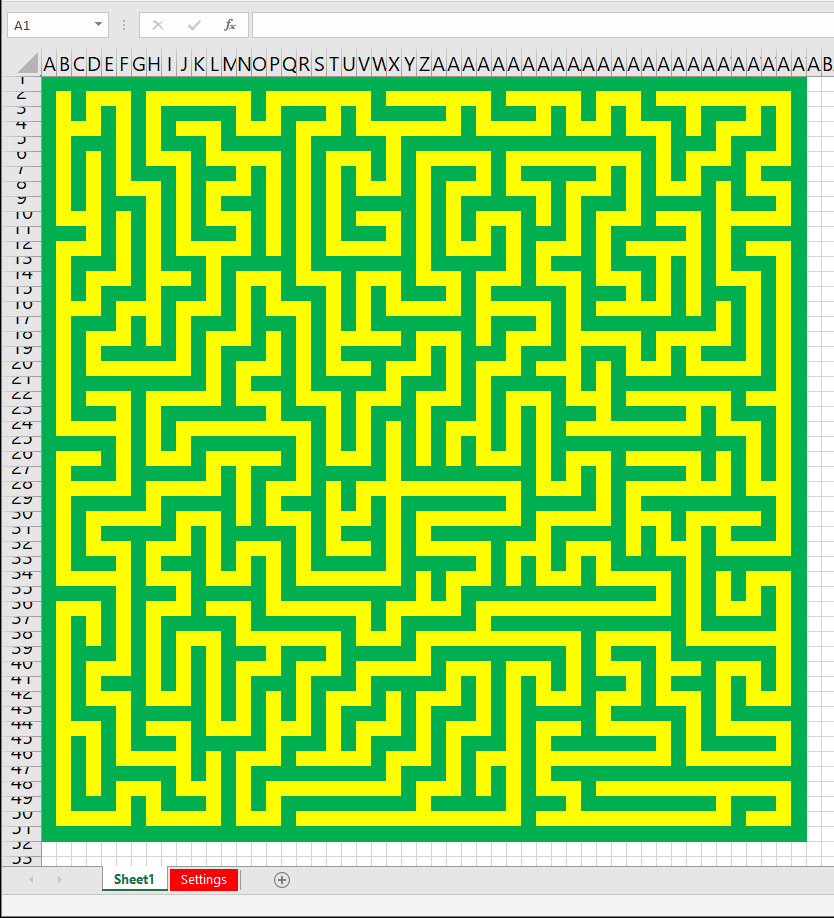

# ExcelMaze

Generating mazes inside an Excel worksheet.

There is a huge amount of web resources for doing that. Here's another one.

This repository provides two files:

- *ExcelMaze.xlsm* - Excel workbook with embedded macros
- *ExcelMaze.vba* - Macros in a separate file (you don't need it)

## Usage

1. Open Excel workbook *ExcelMaze.xlsm*
2. Enter dimensions of the maze
3. Enter block size and color:
   1. The size of cell **A1** determines the size of the blocks.
   2. The color of cell **A1** determines the color of the walls.
   3. The color of cell **A2** determines the color of the paths.
4. Press *START* button

## VBA Code

There are three procedures:
- ```Sub Start()``` - Called when the *START* button is pressed
- ```Sub CreateMaze(...)``` - Creates a new maze using a classic non-recursive backtracking algorithm
- ```Sub CopyMazeToSheet(...)``` - Copies the maze into a new worksheet

## Screenshots

1. Parameters: 



2. Maze:


